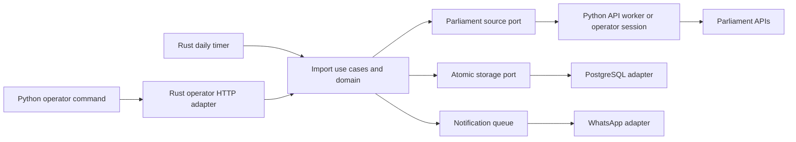

# Application-owned imports

The [agreed specification](specs/rust-import-ownership.md) moves import policy and
persistence from Python into Rust. The Python package now contains only the
Parliament HTTP client, its NDJSON worker, and the operator command client.

| Boundary | Location | Responsibility |
| --- | --- | --- |
| Business values | `exposed/src/lib/imports/core/{members,declarations}.rs` | Service invariants, latest version, payer precedence, parent completion, funder normalization and metadata merging, payment equality |
| Import use cases | `imports/core/refresh.rs` | Cohort selection, duplicates, completeness, page ordering, per-declaration rejection and atomic publication |
| Coordination | `imports/core/coordinator.rs` | One run at a time, repeatable initialization, persisted freshness, retry outcomes, optional notification policy |
| Ports | `imports/core/ports.rs` | Member/declaration sources, atomic storage, notifications and durable delivery queue |
| Parliament adapter | `imports/adapters/{parliament,declarations}.rs` | Source aliases, envelope decoding, pagination cursors, nested source fields and exact decimal decoding |
| PostgreSQL adapter | `imports/adapters/postgres.rs` | Transactions, stable IDs, shared funder identities, refresh state and notification queue |
| Operator adapter | `imports/admin.rs` | Authenticated or loopback HTTP sessions, correlated evidence and replayable acknowledgements |
| Composition | `imports/runtime.rs`, `src/bin/main.rs` | Configuration, clocks, concrete adapters, server and timer lifetimes |
| Python transport | `ingest/src/exposed/source.py` | API paths/filters, sequential requests, throttling, bounded HTTP retries and raw responses |
| Python command | `ingest/src/exposed/{cli,operator}.py` | Operator arguments, following Rust's source requests, JSON summaries and exit codes |

The core imports neither SQLx, Axum, HTTP clients nor process/environment APIs.
It receives source evidence as an opaque JSON value plus adapter-supplied identity
and retrieval context. It compares complete evidence before asking the source
adapter to interpret it. Parliament field names stay outside the core.

## Atomicity and compatibility

Member refresh reads the current Commons stream first, then historical candidate
pages. Rust checks duplicates before requesting histories, verifies exact history
coverage, validates clipped Commons service, and publishes one whole candidate
batch. It commits before requesting the next page. A later failure or final
completeness failure leaves completed batches intact. Unmentioned members remain.
A different stored Parliament is rejected; automatic rollover is not implemented.

Declaration refresh reads the stored current/former cohort once. It also checks
current Commons profiles for new IDs without writing members. For each MP it
collects all pages, remembers raw records before interpretation, and resolves
parents only when the core requires them. Parsing rejection preserves that
record's existing header and payments; accepted siblings continue. Conflicting
raw duplicates, required-parent request failures, or storage errors fail the run.

Accepted declarations are held in memory until that MP's source traversal has
completed, then published in one transaction. This preserves the previous atomic
publication boundary while avoiding a transaction spanning network requests.
Completed MPs remain visible if a later MP fails. Source records remain transient;
there is no raw archive or inferred deletion. Every run reparses all available
responses, including unchanged JSON.

Declaration UUIDs stay stable. Funding equality ignores order and preserves
multiplicity. Shared funder metadata corrections do not replace unchanged funding
UUIDs; changing a payment group replaces that entire group. Calendar dates are
stored at midnight UTC. New IDs use PostgreSQL's UUIDv7 default.

Old Python model/importer/database facades are retired. Operator commands remain
`import-members` and `import-declarations`; their results keep JSON stdout and
0/1/2/130 success/failure/configuration/interruption exits. Declaration results add
`rejected` and `new_members`. `initialize` runs the same two operations in order.
It is repeatable, not a substitute for database backups or migrations.

## Source sessions and scheduling

Manual commands acquire evidence in Python but let Rust determine each next
request. The HTTP session returns a source request and sequence number; Python
returns untouched JSON, retrieval time and context. Rust performs any required
validation/commit before returning another source request. Repeating the same
session/sequence/body replays its acknowledgement. Conflicting sequences fail.
A disconnected source expires after five minutes; explicit cancellation aborts
its task. Completed sessions are retained briefly for acknowledgement replay.

Scheduled refresh uses the same source adapter over a persistent Python NDJSON
worker, sharing the HTTP client within a run. The process is killed when the run
ends or is cancelled. Its environment excludes database and notification secrets.
Python owns four HTTP attempts, the 0.2-second request delay and Retry-After handling.
Rust owns run retries: five minutes, fifteen minutes, then hourly. These are
implementation defaults, separate from the deferred notification frequency.

The timer checks once a minute. Successful source traversal schedules the next
run 24 hours after its start, so traversal time does not accumulate each day.
Failures preserve `last_completed`; parse rejections complete with warnings.
Interrupted runs become due again after restart. This is an operational target,
not a guarantee when Parliament or the database is unavailable. Freshness refers
to information Parliament has published. Status is exposed at `/imports/status`.

A PostgreSQL advisory lock is held on a dedicated connection for the whole import,
including initialization. The connection closes on cancellation or completion,
releasing the lock across application instances. Migrations remain explicit and
must run while imports are stopped.

## Notifications

The application queues status summaries only when an explicit notification
interval is configured. The WhatsApp adapter sends an approved Business Platform
template with one body-text parameter. Credentials and sender setup are external
configuration; no messages are sent by setup or tests. Delivery failures use an
independent durable queue with backoff. They never change import success.
Delivery is at least once: a crash after provider acceptance but before recording
success may cause a duplicate. Delta resolution, richer run metadata, rollover
and agent control remain deferred.

## Verification

The approved seams are import operations, source transport, atomic persistence,
and operator commands. Rust tests cover real PostgreSQL rollback, stable IDs,
payment multiplicity, shared metadata, source ordering, parent lookup, rejection,
duplicate evidence, concurrency, restart state and repeatable initialization.
The Python operator is also exercised against the real Rust HTTP adapter with
only Parliament requests substituted. Search uses an isolated seeded database.

`imports/tests/declaration_cases.json` contains 92 distinct source examples and
expected projections/rejections captured from the Python implementation at
`eef6697d7b0eb47c477abcc0fc05a8a3b4d5e789`. Repeated fixtures differing only in
member/declaration IDs were collapsed. It covers the old unit and declaration
integration cases; expected results were not generated by the new Rust parser.
Python tests enforce the absence of database and domain dependencies.

Run `make check` after local setup. Tests create temporary databases and never
reset the application database. SQLx's existing query macros require an initialized
schema at build time. The repository's blanket Clippy restriction configuration
already fails on the starting revision; lint diagnostics are separate from the
passing Rust build and behavioral checks.
