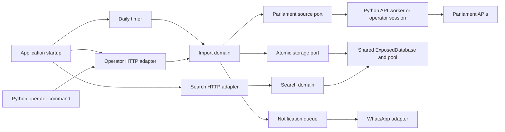

# Application architecture

The [agreed specification](specs/rust-import-ownership.md) moves import policy and
persistence from Python into Rust. The Python package now contains only the
Parliament HTTP client, its NDJSON worker, and the operator command client.

## Decision: integrate imports with the existing layers

Imports use the application's `domain`, `inbound`, and `outbound` layout. The
earlier `imports/{core,adapters,admin,runtime}` tree duplicated those layers and
created a second database pool without a requirement for resource isolation.
`application.rs` now composes search and imports together. The domain's import
values, rules, use cases, and ports stay together in `domain/imports`; this keeps
their contracts local without giving imports a separate infrastructure lifecycle.

The shared infrastructure is `outbound::ExposedDatabase`. It implements the search
repositories, `ImportStore`, and `NotificationQueue` over one pool created at
startup. The pool has ten connections and a 15-second acquisition timeout. An
import holds one connection for its advisory lock and uses another for each short
publication transaction. Search, imports, and notifications share this connection
budget. Source fetching holds no write transaction. Separate pools would require
an explicit capacity or isolation requirement; none is established here.

Import contracts remain distinct from search contracts:

- Search repositories return member and funder projections. Import ports publish
  whole member batches and MPs, select the cohort, and persist refresh state.
- Import member values carry source identity and service history. Declaration
  drafts carry unresolved parents, optional metadata, and rejection state. These
  cannot be represented by the existing search projections or declaration stub.
- Funder kind is optional source text during import; the search projection's
  closed enum is not a lossless input type. Payment equality and funder metadata
  merging remain domain rules used by the PostgreSQL adapter.
- The application supplies the database and clock to the operator handlers. It
  owns both HTTP listeners, the scheduled refresh, and notification delivery.
  The separate operator listener remains because it has its own access policy.

### Module map

Rust paths below are relative to `exposed/src/lib/`.

| Module | Location | Responsibility |
| --- | --- | --- |
| Search domain | `domain/{models,repositories,services}/` | Search values, repository ports, entity search and result ordering |
| Import values | `domain/imports/{members,declarations}.rs` | Service invariants, latest version, payer precedence, parent completion, funder normalization and metadata merging, payment equality |
| Import use cases | `domain/imports/refresh.rs` | Cohort selection, duplicates, completeness, page ordering, per-declaration rejection and atomic publication |
| Coordination | `domain/imports/coordinator.rs` | One run at a time, repeatable initialization, persisted freshness, retry outcomes, optional notification policy and clock port |
| Import ports | `domain/imports/ports.rs` | Member/declaration sources, atomic storage, notifications and durable delivery queue |
| Parliament adapter | `outbound/parliament.rs`, `outbound/parliament/declarations.rs` | Source aliases, envelope decoding, pagination cursors, nested source fields and exact decimal decoding |
| PostgreSQL adapter | `outbound/postgres.rs`, `outbound/postgres/imports.rs`, `outbound/{funder,parliament_member}.rs` | Shared pool, search queries, import transactions, stable IDs, shared funder identities, refresh state and notification queue |
| WhatsApp adapter | `outbound/whatsapp.rs` | Delivery through an approved Business Platform template |
| Search HTTP adapter | `inbound/http/{routes,handlers,server}.rs` | Search requests and HTTP responses using supplied dependencies |
| Operator HTTP adapter | `inbound/http/imports.rs` | Authenticated or loopback HTTP sessions, correlated evidence and replayable acknowledgements |
| Configuration | `config.rs`, `config/imports.rs` | Application, import, and notification settings |
| Composition | `application.rs`, `../bin/main.rs` | Shared database, clocks, concrete adapters, both listeners, timers and application shutdown |
| Python transport | `ingest/src/exposed/source.py` | API paths/filters, sequential requests, throttling, bounded HTTP retries and raw responses |
| Python command | `ingest/src/exposed/{cli,operator}.py` | Operator arguments, following Rust's source requests, JSON summaries and exit codes |

The import domain imports neither SQLx, Axum, HTTP clients nor process/environment APIs.
It receives source evidence as an opaque JSON value plus adapter-supplied identity
and retrieval context. It compares complete evidence before asking the source
adapter to interpret it. Parliament field names stay outside the core.

```mermaid
flowchart LR
  App[Application startup] --> Timer[Daily timer]
  App --> SearchHTTP[Search HTTP adapter]
  App --> Admin[Operator HTTP adapter]
  Manual[Python operator command] --> Admin
  SearchHTTP --> Search[Search domain]
  Timer --> Core[Import domain]
  Admin --> Core
  Core --> Source[Parliament source port]
  Source --> CLI[Python API worker or operator session]
  CLI --> Parliament[Parliament APIs]
  Core --> Store[Atomic storage port]
  Store --> DB[Shared ExposedDatabase and pool]
  Search --> DB
  Core --> Queue[Notification queue]
  Queue --> WhatsApp[WhatsApp adapter]
```

## Atomicity and compatibility

Member refresh reads the current Commons stream first, then historical candidate
pages. Rust checks duplicates before requesting histories, verifies exact history
coverage, validates clipped Commons service, and publishes one whole candidate
batch. It commits before requesting the next page. A later failure or final
completeness failure leaves completed batches intact. Unmentioned members remain.
A different stored Parliament is rejected; automatic rollover is not implemented.

Declaration refresh reads the stored current/former cohort once. It also checks
current Commons profiles for new IDs without writing members. For each MP it
collects all pages, remembers raw records before interpretation, and resolves
parents only when the core requires them. Parsing rejection preserves that
record's existing header and payments; accepted siblings continue. Conflicting
raw duplicates, required-parent request failures, or storage errors fail the run.

Accepted declarations are held in memory until that MP's source traversal has
completed, then published in one transaction. This preserves the previous atomic
publication boundary while avoiding a transaction spanning network requests.
Completed MPs remain visible if a later MP fails. Source records remain transient;
there is no raw archive or inferred deletion. Every run reparses all available
responses, including unchanged JSON.

Declaration UUIDs stay stable. Funding equality ignores order and preserves
multiplicity. Shared funder metadata corrections do not replace unchanged funding
UUIDs; changing a payment group replaces that entire group. Calendar dates are
stored at midnight UTC. New IDs use PostgreSQL's UUIDv7 default.

Old Python model/importer/database facades are retired. Operator commands remain
`import-members` and `import-declarations`; their results keep JSON stdout and
0/1/2/130 success/failure/configuration/interruption exits. Declaration results add
`rejected` and `new_members`. `initialize` runs the same two operations in order.
It is repeatable, not a substitute for database backups or migrations.

## Source sessions and scheduling

Manual commands acquire evidence in Python but let Rust determine each next
request. The HTTP session returns a source request and sequence number; Python
returns untouched JSON, retrieval time and context. Rust performs any required
validation/commit before returning another source request. Repeating the same
session/sequence/body replays its acknowledgement. Conflicting sequences fail.
A disconnected source expires after five minutes; explicit cancellation aborts
its task. Completed sessions are retained briefly for acknowledgement replay.

Scheduled refresh uses the same source adapter over a persistent Python NDJSON
worker, sharing the HTTP client within a run. The process is killed when the run
ends or is cancelled. Its environment excludes database and notification secrets.
Python owns four HTTP attempts, the 0.2-second request delay and Retry-After handling.
Rust owns run retries: five minutes, fifteen minutes, then hourly. These are
implementation defaults, separate from the deferred notification frequency.

The timer checks once a minute. Successful source traversal schedules the next
run 24 hours after its start, so traversal time does not accumulate each day.
Failures preserve `last_completed`; parse rejections complete with warnings.
Interrupted runs become due again after restart. This is an operational target,
not a guarantee when Parliament or the database is unavailable. Freshness refers
to information Parliament has published. Status is exposed at `/imports/status`.

A PostgreSQL advisory lock is held on a connection checked out from the shared
pool for the whole import, including initialization. It is marked to close on drop
before the lock query is sent. Cancellation can then release a lock even when
PostgreSQL has acquired it and SQLx has not yet received the response. Completion
also closes this connection; the rest of the pool remains available. The lock
serializes imports across application instances. Migrations remain explicit and
must run while imports are stopped.

## Notifications

The application queues status summaries only when an explicit notification
interval is configured. The WhatsApp adapter sends an approved Business Platform
template with one body-text parameter. Credentials and sender setup are external
configuration; no messages are sent by setup or tests. Delivery failures use an
independent durable queue with backoff. They never change import success.
Delivery is at least once: a crash after provider acceptance but before recording
success may cause a duplicate. Delta resolution, richer run metadata, rollover
and agent control remain deferred.

## Verification

The approved seams are import operations, source transport, atomic persistence,
and operator commands. Rust tests cover real PostgreSQL rollback, stable IDs,
payment multiplicity, shared metadata, source ordering, parent lookup, rejection,
duplicate evidence, concurrency, restart state and repeatable initialization.
The Python operator is also exercised against the real Rust HTTP adapter with
only Parliament requests substituted. Search uses an isolated seeded database.

`exposed/src/lib/tests/imports/declaration_cases.json` contains 92 distinct source examples and
expected projections/rejections captured from the Python implementation at
`eef6697d7b0eb47c477abcc0fc05a8a3b4d5e789`. Repeated fixtures differing only in
member/declaration IDs were collapsed. It covers the old unit and declaration
integration cases; expected results were not generated by the new Rust parser.
Python tests enforce the absence of database and domain dependencies.

The cancellation regression uses a local TCP proxy and an isolated database to
pause the advisory-lock response after acquisition on the server. It cancels the
waiting import, verifies another import can acquire the lock, and checks that the
original pool still executes queries. CLI regressions reject malformed operator
URLs from arguments and environment configuration with exit 2, stderr diagnostics,
and no HTTP requests.

Run `make check` after local setup. Tests create temporary databases and never
reset the application database. SQLx's existing query macros require an initialized
schema at build time. The repository's blanket Clippy restriction configuration
already fails on the starting revision; lint diagnostics are separate from the
passing Rust build and behavioral checks.
